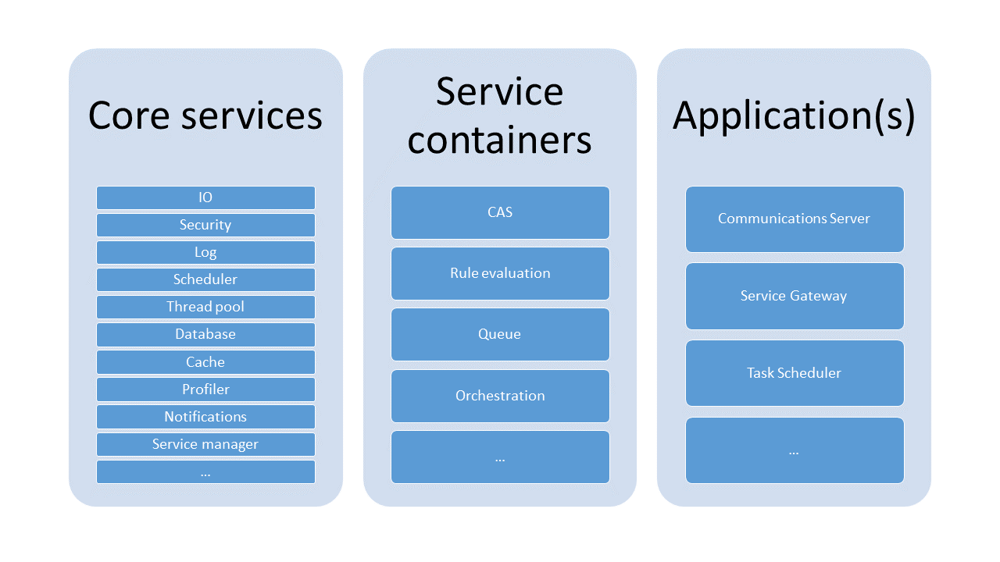

# SCF
SCF is short for Service Component Framework, a service oriented architecture built for both creating cloud micro services and traditional applications. The same components can be used and combined in a highly generic manner in the same operating system process (traditional application) or split up as individual micro services in some cloud framework.

## Overview


The above picture describes an SCF instance. An instance is essentially everything that is loaded into one micro service instance or operating system process.
Each SCF instance consists of
   * Core services
   * Services grouped in containers
   * Applications

An SCF instance is configured using a set of XML configuration files on a standardized format. There are two main parts of the configuration:
   * Kernel configuration
   * Package configuration

The kernel configuration is the system configuration for the SCF. It is typically the same configuration for all instances of a certain flavor of SCF, so for example Communications Server will have it's own variant kernel configuration which will differ slightly from the Service Gateway variant. The kernel configuration is typically part of the installation. The kernel configuration file is called kernel.xml by default but it is possible to override this name by specifying it on the command line with the -kernel startup argument.

The package configuration is the instance configuration for the SCF. It will contain things that are configurable on a per instance basis. An example of this is the size of thread pools in service gateway or the size of memory buffers for storing temporary data. Package configuration usually overrides some default kernel configuration for a certain SCF flavor. The package configuration file is called packages.xml by default but it is possible to override this name by specifying it on the command line with the -packages startup argument.

All SCF configuration files follow the same syntax:
```xml
<?xml version="1.0"?>
<strs xmlns="http://schemas.streamserve.com/kernel/1.0">

    <!-- Optional include statements -->
    <include xlink:type="simple" xlink:href="file://included.xml" />

    <!-- Optional core services -->
    <kernel>
        <managers>
            <manager type="core service type identifier">
                <configuration>
                    <!-- Core service configuration -->
                </configuration>
            </manager>
        </managers>
    </kernel>

    <!-- Optional service containers / services -->
    <containers>
        <container type="container type identifier">
            <name value="container name" />
            <configuration>
                <servicecontainer xmlns="http://schemas.streamserve.com/uid/component/servicecontainer/1.0">
                    <servicecontroller type="controller type identifier">
                        <configuration>
                            <servicecontroller xmlns="http://schemas.streamserve.com/uid/component/servicecontroller/1.0">
                                <services>
                                    <!-- Service specifications here -->
                                </services>
                            </servicecontroller>
                        </configuration>
                    </servicecontroller>
                </servicecontainer>
            </configuration>
        </container>
    </containers>

    <!-- Optional applications -->
    <applications>
        <application type="application type identifier" name="application name">
            <configuration>
                <!-- Application specific configuration -->
            </configuration>
        </application>
    </applications>

</strs>
```

Type identifiers in the configuration files generally follow a naming scheme that can aid in classifying the identifier: `http://schemas.streamserve.com/uid/<component type>/<component name>/<component version>`. Even though the identifier starts with http:// this is just a naming convention and there is no content at the adress it points to. The parts of the identifier are interpreted as follows:
   * Component type: This is what the name suggests. It is usually one of the following:
      * manager: A manager implements one or more core services.
      * component: A component implements a certain piece of functionality, for example blob on disk storage for databases. A component can also be the base of a service.
      * service: A more advanced component that comes with configuration, dependencies, subscriptions and metadata. More on this later.
      * application: An SCF application.
      * resource: A resource identifier, for example connection information to a web server.
      * container: Typically used as part of a container name.
   * Component name: The logical name of the component, for example threadpool or odbcconnection.
   * Component version: A major.minor version of the component.

### Core services
Core services provide the base functionality of SCF, things like scheduling support, system wide notifications, security and database access. Core services are grouped into managers and each manager is described in more detail in separate sections.